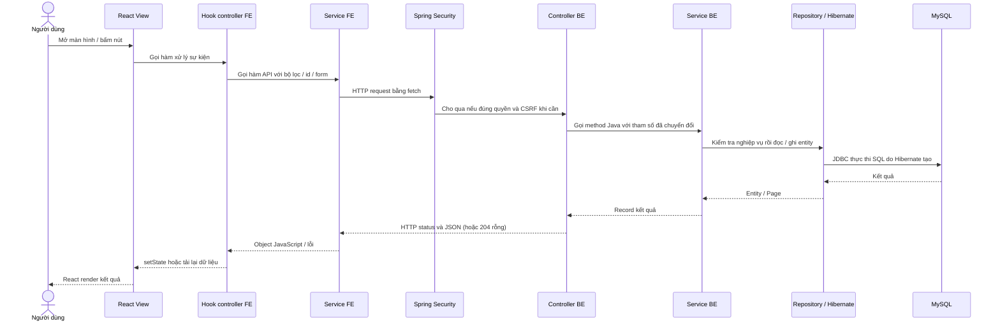

# Luồng sản phẩm: FE → BE → database

Tài liệu đối chiếu trực tiếp code hiện tại cho 6 chức năng trong ảnh: Product List, Product Details/review, Product Management, Favorite Product, View Favorite Product, Product Category. Các ví dụ id bên dưới chỉ để minh họa, khi gọi thật phải dùng id đang có trong DB.

## 1. Cách đọc code và dữ liệu đi qua các tầng



FE và BE là hai chương trình khác nhau: FE không gọi trực tiếp method Java. FE gửi **HTTP** tới một URL; Spring tìm method có `@GetMapping`, `@PostMapping`... khớp URL và HTTP method đó. Sau khi vào BE, controller → service → repository là lời gọi method Java trong cùng ứng dụng, không phải các HTTP request mới.

| Tầng | Công việc | Ví dụ trong dự án |
| --- | --- | --- |
| View FE | Vẽ giao diện, gắn sự kiện | `ProductCatalogView.jsx`: `onSubmit={c.search}` |
| Hook controller FE | Giữ state, xử lý form, quyết định gọi API lúc nào | `useCatalogController.js`: `search`, `useEffect` |
| Service FE | Dựng URL/body/header rồi `fetch` | `catalogService.browse(filter)` |
| Security BE | Xác thực người gọi, kiểm tra quyền, CSRF | `SecurityConfig`, `JwtAuthenticationFilter` |
| Controller BE | Nhận path/query/body, gọi nghiệp vụ | `PublicCatalogController.browse(...)` |
| Service BE | Kiểm tra điều kiện, đọc/ghi, ghép kết quả | `CatalogService.browse(...)` |
| Repository BE | Khai báo thao tác truy vấn | `ProductRepository.findAll(spec, pageable)` |
| Entity | Ánh xạ thuộc tính Java với bảng/cột | `Product` → `Products` |
| Hibernate + JDBC | Sinh SQL, truyền câu lệnh tới MySQL | MySQL driver trong `flowershop/build.gradle` |

Các file FE nằm trong `flower-shop-client/src/`. Các file Java nằm trong `flowershop/src/main/java/com/example/flowershop/`. Link trong tài liệu mở đúng file tương ứng.

**Điểm vào màn hình:** [AppRouter.jsx](../flower-shop-client/src/AppRouter.jsx).

| URL / nơi mở | Các file được nối với nhau |
| --- | --- |
| `/products` | `AppRouter` → `ProductCatalogView` |
| Trang chủ, tab sản phẩm | `HomeView` → `ProductCatalogView` |
| `/products/:id` | `ProductDetailViewWrapper` lấy id → `ProductDetailView` → `ProductReviewsView` |
| `/favorites` | `AppRouter` → `FavoritesView` |
| `/shop-admin/products` | `ManagerDashboardView` chọn `section=products` → `ManagerShopsView` → `ProductsView` với `manage=true` |
| `/admin/categories` | `AdminDashboardView` → `AdminCategoriesView`, gồm danh mục và kiểm duyệt sản phẩm |
| `/shops/:id` | `PublicShopView` → `ProductsView` với `manage=false` |

**Request công khai:** [catalogService.js](../flower-shop-client/src/services/catalogService.js) gọi `fetch`, đọc `response.json()` rồi trả object cho hook. `new URLSearchParams(filter)` đưa bộ lọc vào query string. `encodeURIComponent(id)` mã hóa id đưa vào URL.

**Request cần đăng nhập:** các service quản lý/favorite/review gọi [authService.js](../flower-shop-client/src/services/authService.js):

1. `authenticatedRequest(path, options)` kiểm tra access token trong `authModel`; thiếu token thì `refresh()`.
2. `request(...)` lấy CSRF từ `GET /api/auth/csrf` cho method khác GET, gắn token vào header mà BE chỉ định.
3. Gắn `Authorization: Bearer ...`; JSON body được `JSON.stringify`. Với `FormData`, trình duyệt tự đặt multipart boundary.
4. `fetch` gửi HTTP và cookie qua `credentials: 'include'`.
5. Nếu 401, `authenticatedRequest` thử refresh và gửi lại một lần. Các lỗi khác được ném về hook.
6. [JwtAuthenticationFilter.java](../flowershop/src/main/java/com/example/flowershop/security/JwtAuthenticationFilter.java) lấy Bearer → `TokenAuthService.authenticate` kiểm tra JWT, session và user trong DB → đưa `CurrentUser` cùng role vào `SecurityContext`.
7. [SecurityConfig.java](../flowershop/src/main/java/com/example/flowershop/config/SecurityConfig.java) cùng `@PreAuthorize` kiểm tra quyền. `@AuthenticationPrincipal` trong controller nhận người dùng đã xác thực. FE không được tự quyết định userId để ghi favorite/review cho người khác.

**Kết quả trở về FE:** Spring chuyển record kết quả sang JSON; service FE đọc JSON; hook gọi `setData`, `setProduct`...; React render lại. Sau thao tác ghi, nhiều hook tăng `revision`; `useEffect` phụ thuộc `revision` chạy lại để GET dữ liệu mới. `active=false` trong cleanup chỉ ngăn response cũ cập nhật state, không hủy HTTP request.

## 2. BE thực sự nói chuyện với database thế nào?

[application.properties](../flowershop/src/main/resources/application.properties) cấu hình JDBC tới MySQL `localhost:3307/flower_shop_db`. [docker-compose.yml](../docker-compose.yml) ánh xạ cổng máy 3307 vào cổng MySQL 3306 và dùng [database.sql](../database.sql) để khởi tạo DB khi volume mới được tạo.

Ví dụ `CatalogService` nhận `ProductRepository` qua constructor. Spring tạo và truyền object repository vào; khi gọi `products.findAll(...)`, Spring Data/Hibernate thực hiện truy vấn, không cần tự viết `new ProductRepository()` hoặc một file `ProductRepositoryImpl`.

| Lời gọi Java | Ý nghĩa database |
| --- | --- |
| `findById(id)` | Đọc hàng theo khóa chính |
| `findByShopId(shopId, pageable)` | Spring suy ra điều kiện theo `shop.id`, có phân trang |
| `findByIdAndShopId(id, shopId)` | Đọc đúng sản phẩm thuộc shop đã chỉ định |
| `findAll(spec, pageable)` | `Specification` dựng điều kiện lọc; Hibernate sinh SQL |
| `@Query("select ... from Product ...")` | JPQL theo tên entity/thuộc tính; Hibernate dịch sang bảng/cột SQL |
| `saveAndFlush(entity)` | Lưu rồi đồng bộ thay đổi INSERT/UPDATE xuống DB; chưa đồng nghĩa transaction đã commit |
| `delete(entity)` / `deleteById(key)` | Xóa entity/bản ghi tương ứng |
| Setter trên entity đang được quản lý trong transaction | Hibernate phát hiện thay đổi và UPDATE khi flush/commit, gọi là dirty checking |

`@Transactional` tạo phạm vi transaction. Method ghi của service ghi đè `readOnly=true` trên class. Lỗi runtime trong phạm vi transaction thông thường làm rollback các thay đổi DB. Transaction DB không tự hoàn tác file đã upload ra Cloudinary.

**Vì sao `hide()` không gọi `save()` mà vẫn ghi DB?** `ManagerProductService.hide` có `@Transactional`; `findByIdAndShopId` trả entity được quản lý; `p.setStatus(INACTIVE)` làm entity thay đổi; khi transaction commit, Hibernate tự UPDATE hàng `Products` đó.

**Quan hệ bảng quan trọng:**

| Entity / bảng | Khóa, quan hệ và dữ liệu |
| --- | --- |
| [Product](../flowershop/src/main/java/com/example/flowershop/entity/Product.java) / `Products` | `id`; `shop_id → Shops`, `category_id → Categories`; tên, giá, tồn kho, status, product_type, admin_hidden |
| [Category](../flowershop/src/main/java/com/example/flowershop/entity/Category.java) / `Categories` | `id`, tên, mô tả, status; một danh mục có nhiều sản phẩm |
| [ProductImage](../flowershop/src/main/java/com/example/flowershop/entity/ProductImage.java) / `Product_Images` | `product_id → Products`; URL, ảnh chính, thứ tự |
| [ProductVideo](../flowershop/src/main/java/com/example/flowershop/entity/ProductVideo.java) / `Product_Videos` | `product_id → Products`; URL, tiêu đề, mô tả |
| [ProductReview](../flowershop/src/main/java/com/example/flowershop/entity/ProductReview.java) / `Product_Reviews` | `product_id`, `user_id`; số sao, comment, shop_reply; mỗi cặp user/product tối đa một review theo unique constraint |
| [FavoriteProduct](../flowershop/src/main/java/com/example/flowershop/entity/FavoriteProduct.java) / `Favorite_Products` | Khóa ghép `(user_id, product_id)` qua [FavoriteProductId](../flowershop/src/main/java/com/example/flowershop/entity/FavoriteProductId.java); một hàng là một lượt lưu của một khách |

`@ManyToOne(fetch=LAZY)` không nhất thiết nạp quan hệ ngay. Service dựng kết quả trong transaction để có thể đọc `p.getShop().getName()` và `p.getCategory().getName()`. Kết quả gửi FE là record chứa trường cần dùng, không trả nguyên entity cùng tất cả quan hệ.

[011_product_catalog.sql](../flowershop/sql/011_product_catalog.sql) bổ sung cờ Admin ẩn, cho phép review không có order và unique user/product. [013_product_type.sql](../flowershop/sql/013_product_type.sql) thêm `product_type`. Đây là script thay đổi schema, không phải file chạy lại cho mỗi lần người dùng bấm nút. Chỉ đọc code chưa xác nhận DB đang chạy đã áp dụng các script này hay chưa.

## 3. Product List — hiển thị, tìm kiếm, lọc, phân trang

Chuỗi gọi chính:

```text
ProductCatalogView.jsx
  → useCatalogController.js: useEffect / search / các setter
  → catalogService.js: browse(filter) → get(path) → fetch
  → GET /api/public/products
  → PublicCatalogController.java: browse(...)
  → CatalogService.java: browse(...) bản đầy đủ
  → ProductRepository.java: findAll(spec, PageRequest)
  → Products + Shops, tham chiếu Categories
  → ProductCardAssembler.java: cards(...)
      → ProductImageRepository: findByProductIdInOrderByDisplayOrderAscIdAsc
      → ProductReviewRepository: summarize
  → JSON Results → setData → c.data.content.map(...) vẽ thẻ
```

1. Mở [ProductCatalogView.jsx](../flower-shop-client/src/views/ProductCatalogView.jsx), màn hình gọi [useCatalogController](../flower-shop-client/src/controllers/useCatalogController.js).
2. `emptyProductFilter()` trong [productModel.js](../flower-shop-client/src/models/productModel.js) khởi tạo bộ lọc; `page=0`, `sort=newest`.
3. Các effect lấy danh mục, cửa hàng cho ô chọn và gọi `catalogService.browse(filter)` lấy trang sản phẩm. Nếu được truyền `initialShops`, hook dùng danh sách shop đó thay cho request riêng.
4. Ví dụ request: `GET /api/public/products?q=hồng&categoryId=cat-01&shopId=shop-01&type=READY_MADE&minPrice=100000&maxPrice=500000&sort=price_asc&page=0`. Giá trị thật được URL-encode; `size` không gửi thì BE mặc định 12.
5. [PublicCatalogController.browse](../flowershop/src/main/java/com/example/flowershop/controller/PublicCatalogController.java) nhận `@RequestParam`, chuyển giá sang `BigDecimal`, loại thành `ProductType`, rồi gọi service.
6. [CatalogService.browse](../flowershop/src/main/java/com/example/flowershop/service/CatalogService.java) kiểm tra page/size, khoảng giá, độ dài từ khóa, cách sắp xếp; escape ký tự đặc biệt của tìm kiếm LIKE.
7. `Specification<Product>` kết hợp điều kiện: sản phẩm `ACTIVE`, `adminHidden=false`, shop `ACTIVE`, rồi thêm các bộ lọc được gửi. Không tự yêu cầu tồn kho lớn hơn 0 hoặc danh mục phải ACTIVE.
8. `products.findAll(spec, PageRequest.of(...))` đọc DB có phân trang.
9. [ProductCardAssembler.cards](../flowershop/src/main/java/com/example/flowershop/service/ProductCardAssembler.java) gom id, đọc ảnh theo lô, tổng hợp điểm theo lô rồi ghép từng `ProductCard`. Nó tránh gọi riêng truy vấn ảnh/review cho từng thẻ; không có nghĩa mọi quan hệ LAZY đều chỉ tốn một truy vấn.
10. Service trả `Results(content, page, size, totalElements, totalPages)`. FE `setData(value)` rồi map `content` thành thẻ, hiển thị tổng số và nút phân trang.

| Hàm trong hook/model | Khi nào chạy, để làm gì |
| --- | --- |
| `search(event)` | Khi submit tìm kiếm: chặn tải lại trang, kiểm tra khoảng giá, áp dụng draft và đưa page về 0 |
| `setCategory`, `setShop`, `setType`, `setSort` | Thay bộ lọc, reset page=0; effect gọi lại browse |
| `changePage(delta)` | Đổi chỉ số trang rồi effect tải trang khác |
| `retry()` | Tạo object filter mới để effect chạy lại |
| `formatPrice(value)` | Định dạng tiền cho UI, không ghi DB |
| `ratingLabel(card)` | Hiển thị điểm/số review hoặc chưa có đánh giá |
| `primaryImages(ids)` | Assembler chọn ảnh có cờ chính; không có thì lấy ảnh đầu theo thứ tự |
| `ratings(ids)` | Gọi repository `summarize`: `AVG(rating)`, `COUNT`, nhóm theo sản phẩm |

Danh sách trong riêng một shop đi theo nhánh `ProductsView(manage=false)` → `useProductsController` → `productService.published(shopId,page)` → [PublicProductController.list](../flowershop/src/main/java/com/example/flowershop/controller/PublicProductController.java) → `CatalogService.published` → `browse` với shopId cố định và 20 mục/trang.

## 4. Product Details — chi tiết và review

**Chi tiết sản phẩm:**

1. Bấm tên thẻ → `/products/{id}`. `ProductDetailViewWrapper` trong router lấy id từ URL.
2. [ProductDetailView](../flower-shop-client/src/views/ProductDetailView.jsx) gọi [useProductDetailController(productId)](../flower-shop-client/src/controllers/useProductDetailController.js).
3. Effect gọi `catalogService.detail(id)` → `GET /api/public/products/{id}`.
4. `PublicCatalogController.detail` → `CatalogService.detail`.
5. `products.findById(id)` rồi `ProductCardAssembler.visible` kiểm tra sản phẩm còn được công khai; không đạt trả 404.
6. `ProductImageRepository.findByProductIdOrderByDisplayOrderAscIdAsc` lấy gallery, sắp ảnh chính lên trước. `assembler.ratings(List.of(id))` lấy điểm trung bình và số review.
7. Trả `ProductDetail`: tên, loại, mô tả, giá, tồn kho, shop, danh mục, `images`, `rating`, `reviewCount`.
8. Hook `setProduct`; View hiển thị dữ liệu. `reload()` tăng revision để tải lại chi tiết.

**Review là một luồng API riêng:** sau khi có `product`, màn hình gắn [ProductReviewsView](../flower-shop-client/src/views/ProductReviewsView.jsx) → [useProductReviewsController](../flower-shop-client/src/controllers/useProductReviewsController.js) → [reviewService](../flower-shop-client/src/services/reviewService.js).

| Thao tác | FE gọi | HTTP | Controller → service → DB |
| --- | --- | --- | --- |
| Đọc danh sách | effect → `list(id,page)` | `GET /api/public/products/{id}/reviews?page=0` | `PublicCatalogController.reviews` → `ProductReviewService.list` → `findByProductId`, 10 mục/trang |
| Đọc review của mình | effect → `own(id)` | `GET /api/customer/products/{id}/reviews` | `ProductReviewController.mine` → `mine` → `findByProductIdAndUserId` |
| Viết mới | `submit` → `write(id,body)` | `POST` cùng URL customer | `write` → kiểm tra visible và chưa review → `saveAndFlush` INSERT |
| Sửa | `submit` → `update(id,body)` | `PUT` cùng URL customer | `update` → tìm theo productId + userId → UPDATE |
| Xóa | `remove` → `remove(id)` | `DELETE` cùng URL customer | `delete` → tìm review của mình → repository.delete |
| Shop phản hồi | `reply(shopId,reviewId)` | `PUT /api/shop/mine/{shopId}/reviews/{reviewId}/reply` | `reply` → kiểm tra chủ shop/review → UPDATE `shop_reply` |

Ví dụ body viết/sửa: `{"rating":5,"comment":"Hoa đẹp, giao đúng giờ"}`. Body phản hồi: `{"reply":"Cảm ơn bạn đã ủng hộ shop"}`.

[ProductReviewService](../flowershop/src/main/java/com/example/flowershop/service/ProductReviewService.java) có các method chính:

- `visibleProduct`: tìm sản phẩm và kiểm tra quy tắc công khai cho đọc danh sách/viết mới.
- `result`: chỉ lấy tên hiển thị của reviewer, không gửi email; chuyển entity thành `ReviewResult`.
- `mine`: chưa có review của khách thì trả 404; FE `reviewService.own` đổi riêng 404 thành `null` để mở form mới.
- `write`: chặn lần tạo thứ hai bằng kiểm tra cặp user/product, trả 409 nếu đã có. `@Valid` giới hạn sao 1–5, nhận xét tối đa 2000 ký tự.
- `update`, `delete`: tìm review bằng cả productId và người đăng nhập, không dựa vào userId tự gửi từ FE.
- `reply`: `ShopRepository.findForUpdate`, kiểm tra owner và shop ACTIVE, kiểm tra review thuộc sản phẩm của shop đó.

`submit` chọn POST hay PUT dựa vào `own`. `run(action,message)` xử lý busy/error/notice, tăng revision khi thành công để tải lại danh sách và review cá nhân. Điểm ở phần chi tiết phía trên dùng một hook khác nên chưa tự cập nhật ngay theo revision của review.

Code hiện tại không bắt buộc đã mua hàng mới review. Biến FE `ownsShop` chỉ kiểm tra role SHOP; BE mới kiểm tra thật sự sở hữu shop. Quyền đọc endpoint review công khai hiện còn lệch cấu hình, được ghi riêng ở phần 9.

## 5. Product Management — Shop và Admin

**Lấy shopId trước khi quản lý:** `/shop-admin/products` → `ManagerDashboardView` → `ManagerShopsView`. Hook `useManagerShopController` gọi `managerShopService.list('SHOP')` → `GET /api/shop/mine` → `ManagerShopController.mine` → `ManagerShopService.mine` → `ShopRepository.findByOwnerIdOrderByNameAsc`. Shop được chọn trở thành `c.selected`, truyền xuống `ProductsView`. Hook hiện cũng tải staff/address trước khi hoàn tất tự chọn shop.

**Danh sách/form Shop:** [ProductsView](../flower-shop-client/src/views/ProductsView.jsx) → [useProductsController(shop.id,true)](../flower-shop-client/src/controllers/useProductsController.js) → [productService](../flower-shop-client/src/services/productService.js).

| Thao tác | Hàm FE | HTTP | Method BE |
| --- | --- | --- | --- |
| Xem sản phẩm shop mình | effect → `api.list` | `GET /api/shop/mine/{shopId}/products?page=0` | `ManagerProductController.list` → `ManagerProductService.list` |
| Lấy danh mục cho form | effect → `api.categories` | `GET .../products/categories` | controller `categories` kiểm tra shop bằng `service.list`, rồi `service.categories` |
| Chọn sản phẩm để sửa | `edit(p)` | Chưa gửi HTTP | Đổ p vào form, gán editing=p.id |
| Tạo mới | `save` → `api.save` với editing=null | `POST .../products` | controller `create` → service `save(shopId,null,actor,input)` |
| Lưu sửa | `save` → `api.save` với editing có id | `PUT .../products/{id}` | controller `update` → service `save(shopId,id,actor,input)` |
| Ẩn | `hide` → xác nhận → `api.hide` | `DELETE .../products/{id}` | controller `hide` → service `hide`, đổi status=INACTIVE |
| Hủy sửa | `cancel()` | Không gửi HTTP | Reset editing và form ở FE |

**Theo từng bước một lần bấm Lưu:**

1. Form `onSubmit={c.save}` gọi `save(event)`; `preventDefault` chặn trình duyệt tải lại trang.
2. `save` đổi giá/tồn kho thành số, bỏ URL ảnh rỗng, chuẩn hóa danh sách ảnh, rồi gọi `api.save(shopId, editing, body)`.
3. `productService.save` chọn POST/PUT theo id và dùng `authService.authenticatedRequest` để gửi JSON có Bearer/CSRF.
4. [ManagerProductController](../flowershop/src/main/java/com/example/flowershop/controller/ManagerProductController.java) nhận `shopId`, id nếu sửa, `CurrentUser`, `@Valid @RequestBody ManagerProductService.Input`.
5. [ManagerProductService.save](../flowershop/src/main/java/com/example/flowershop/service/ManagerProductService.java) gọi `owned(shopId,actor,true)`: khóa shop và kiểm tra chủ shop, shop ACTIVE, chủ ACTIVE và có role SHOP.
6. Tạo mới: tạo Product và UUID, gắn shop/createdBy. Sửa: tìm sản phẩm bằng **cả id và shopId**.
7. `CategoryRepository.findById(categoryId)` kiểm tra danh mục ACTIVE. Gán tên/mô tả/giá/tồn kho/status/type; không cho Input sửa adminHidden.
8. `products.saveAndFlush(product)` đồng bộ bản ghi Products.
9. Nếu `images != null`, xóa ảnh cũ theo productId, tạo lại các ProductImage theo URL; chọn một ảnh chính. `images=[]` xóa hết, `images=null` giữ nguyên.
10. `result(stored)` dựng JSON trả về, đặt URL ảnh chính trước. Controller tạo mới trả 201, cập nhật trả 200.
11. FE reset form; `run` tăng revision; effect gọi lại GET danh sách và danh mục; UI hiện kết quả mới.

Ví dụ JSON body:

```json
{
  "name": "Bó hoa hồng",
  "description": "Bó 10 bông hồng",
  "categoryId": "id-danh-muc-thuc-te",
  "price": 250000,
  "stock": 10,
  "status": "ACTIVE",
  "type": "READY_MADE",
  "images": [{ "url": "https://example.com/rose.jpg", "primary": true }]
}
```

`addImage`, `setImageUrl`, `setPrimaryImage`, `removeImage` chỉ thay mảng ảnh của form FE; chưa ghi DB. `result`, `response` của service chuyển entity/Page thành record; `page` tạo phân trang 20 sản phẩm. `list` không loại sản phẩm ẩn, vì chủ shop cần nhìn thấy để quản lý.

**Nhánh ảnh/video đã có API nhưng form hiện tại chưa sử dụng:**

`productService.uploadImage/uploadVideo` tạo FormData → các endpoint `.../products/{id}/images` hoặc `/videos` → `ManagerProductController` → `ManagerProductService.uploadImage/uploadVideo` → [CloudinaryService](../flowershop/src/main/java/com/example/flowershop/service/CloudinaryService.java) → nhận URL → `ProductImageRepository`/`ProductVideoRepository.saveAndFlush`.

`listImages/listVideos` đọc metadata; `imageItem/videoItem` chuyển entity thành record. `deleteImage/deleteVideo` chỉ xóa metadata DB, không gọi xóa file Cloudinary. Giới hạn service: ảnh 5MB với JPEG/PNG/WebP; video 50MB với MP4/WebM/MOV. `ProductsView` hiện chỉ nhập URL HTTPS, tối đa 10 ảnh trong Input; màn chi tiết hiện vẽ ảnh, chưa vẽ video.

**Nhánh Admin:** ảnh mô tả “Shop/Admin CRUD sản phẩm”, nhưng code thực tế chia quyền như sau:

- Shop: tạo, xem, sửa, ẩn sản phẩm của shop mình. DELETE là ẩn mềm, không DELETE hàng Products.
- Admin: danh sách sản phẩm toàn sàn và ẩn/bỏ ẩn để kiểm duyệt; chưa có endpoint Admin tạo/sửa toàn bộ/xóa sản phẩm.

Chuỗi Admin: [AdminCategoriesView](../flower-shop-client/src/views/AdminCategoriesView.jsx) → [useAdminCategoriesController](../flower-shop-client/src/controllers/useAdminCategoriesController.js) → [adminCategoryService](../flower-shop-client/src/services/adminCategoryService.js) → [AdminCatalogController](../flowershop/src/main/java/com/example/flowershop/controller/AdminCatalogController.java) → [AdminCatalogService](../flowershop/src/main/java/com/example/flowershop/service/AdminCatalogService.java).

`api.products(params)` gửi `GET /api/admin/products` → `products` dựng bộ lọc tên/shop/status → `ProductRepository.findAll` → assembler trả thẻ, kể cả sản phẩm ẩn. UI hiện dùng ô tìm tên và phân trang. `toggleHidden(product)` xác nhận rồi `api.setHidden(id,!adminHidden)` → `PUT /api/admin/products/{id}/hidden` với `{hidden:true/false}` → controller `hide` → service `setHidden` → UPDATE `Products.admin_hidden`.

Admin bỏ ẩn không tự đổi `Products.status` của Shop. Vì vậy sản phẩm vẫn có thể chưa công khai nếu Shop đang ẩn hoặc cửa hàng bị khóa.

## 6. Favorite Product — bấm tim lưu/bỏ lưu

1. `ProductCatalogView` và `ProductDetailView` gọi chung [useFavoriteToggle(user)](../flower-shop-client/src/controllers/useFavoritesController.js).
2. Với CUSTOMER, effect gọi [favoriteService.ids()](../flower-shop-client/src/services/favoriteService.js): đọc các trang đã lưu rồi tạo `Set` id. View dùng `saved.has(productId)` để hiện tim.
3. Người dùng bấm nút → `toggle(productId)`. Nếu chưa là CUSTOMER thì chuyển tới login cùng đường dẫn quay lại.
4. `wasSaved=false`: `favoriteService.add(id)` → **PUT** `/api/customer/favorites/{productId}`. `wasSaved=true`: `remove(id)` → **DELETE** cùng URL. Không cần body.
5. `authService` gắn Bearer/CSRF; [FavoriteController](../flowershop/src/main/java/com/example/flowershop/controller/FavoriteController.java) lấy `user.id()` từ principal.
6. [FavoriteService.add](../flowershop/src/main/java/com/example/flowershop/service/FavoriteService.java) tìm sản phẩm visible; tạo khóa `(userId,productId)`; nếu đã tồn tại thì return; nếu chưa thì gắn User/Product và `favorites.saveAndFlush`.
7. [FavoriteProductRepository](../flowershop/src/main/java/com/example/flowershop/repository/FavoriteProductRepository.java) + entity FavoriteProduct tạo bản ghi trong Favorite_Products. `remove` dùng `deleteById` với cùng khóa ghép.
8. BE trả 204 rỗng. FE chỉ thêm/xóa id trong Set sau khi request thành công; lỗi thì hiển thị error.

Ví dụ: khách A lưu sản phẩm P tạo khóa `(A,P)`; khách B lưu cùng sản phẩm tạo `(B,P)`. Khách A bỏ lưu chỉ xóa `(A,P)`, không xóa sản phẩm P và không làm mất lượt lưu của B.

`ids()` giới hạn 10 trang × 12 mục = tối đa 120 mục để dựng Set. Đây là giới hạn dữ liệu tải để tô tim, không phải giới hạn tổng số sản phẩm người dùng được lưu trong DB.

## 7. View Favorite Product — trang danh sách đã lưu

1. `/favorites` mở [FavoritesView](../flower-shop-client/src/views/FavoritesView.jsx). View hiển thị thông báo nếu chưa đăng nhập hoặc không phải CUSTOMER; BE cũng kiểm tra role riêng.
2. [useFavoritesController(user)](../flower-shop-client/src/controllers/useFavoritesController.js) effect gọi `favoriteService.mine(page)`.
3. `GET /api/customer/favorites?page=0` → `FavoriteController.mine` → `FavoriteService.mine(user.id(),page)`.
4. `FavoriteProductRepository.findOwned` lọc `f.id.userId = :userId`, phân trang 12 mục, mới lưu trước, dùng productId để ổn định thứ tự.
5. Service lấy Product từ từng FavoriteProduct, đưa vào `assembler.cards` để ghép ảnh, shop, danh mục, rating và `available`.
6. JSON trả `content/page/size/totalElements/totalPages`; hook `setData`; View map content ra thẻ.
7. Sản phẩm đã bị ẩn vẫn còn trong danh sách, mang `available=false`; View hiện “Không còn bán” và không tạo link chi tiết.
8. Bấm “Bỏ lưu” → hook `remove` → DELETE → notice → tăng revision → GET lại trang hiện tại. Nút chuyển trang dùng `setPage`; `reload` tăng revision.

Hai hook trong cùng file có trách nhiệm khác nhau: `useFavoriteToggle` quản lý nút tim/Set id trên list và detail; `useFavoritesController` quản lý một trang đầy đủ các sản phẩm đã lưu.

## 8. Product Category — danh mục và sản phẩm theo danh mục

Theo UI đang được router sử dụng, chức năng này được thể hiện bằng **ô lọc Danh mục trên ProductCatalogView**, không có route `/categories/:id` riêng.

**Nạp danh mục:**

```text
useCatalogController: effect
  → catalogService.categories()
  → GET /api/public/categories
  → PublicCatalogController.categories()
  → CatalogService.categories()
      → ProductRepository.countVisibleByCategory()
      → CategoryRepository.findByStatusOrderByNameAsc(ACTIVE)
  → CategoryCard(id,name,description,productCount)
  → setCategories → các option trong select
```

`countVisibleByCategory` dùng GROUP BY để đếm sản phẩm công khai theo category; service ghép vào từng danh mục, không có sản phẩm thì đếm 0. `findByStatusOrderByNameAsc` chỉ lấy danh mục ACTIVE theo tên.

**Chọn một danh mục:** `onChange` gọi `c.setCategory(id)` → đổi `filter.categoryId`, reset page=0 → effect browse → `GET /api/public/products?categoryId=...` → `CatalogService.browse` thêm điều kiện `root.get("category").get("id")` → DB lọc `Products.category_id` → thẻ sản phẩm được cập nhật. Chọn “Tất cả danh mục” gửi giá trị rỗng, service bỏ điều kiện categoryId.

**Nguồn danh mục do Admin quản lý:** trong cùng `AdminCategoriesView`, `useAdminCategoriesController.save` → `adminCategoryService.create/update` → POST `/api/admin/categories` hoặc PUT `/api/admin/categories/{id}` → `AdminCatalogController.create/update` → `AdminCatalogService.createCategory/updateCategory` → CategoryRepository.saveAndFlush → Categories.

`edit(category)` chỉ mở form tại FE; `save` mới ghi DB; `cancel` bỏ sửa; `run` tăng revision để tải lại. Không có DELETE danh mục: chuyển INACTIVE để ngừng chọn mới. Các sản phẩm cũ thuộc danh mục INACTIVE vẫn có thể hiển thị, vì quy tắc visible không kiểm tra trạng thái danh mục.

## 9. Những điểm dễ hiểu nhầm hoặc chưa khớp trong code hiện tại

Các mục sau là kết quả đọc source; thay đổi lần này chỉ bổ sung comment/tài liệu, chưa sửa nghiệp vụ hoặc cấu hình.

| Điểm | Hành vi hiện tại |
| --- | --- |
| Hai hook tên gần giống | ProductCatalogView dùng `useCatalogController`; `useProductCatalogController` không được màn hình hiện tại import |
| Nhiều DTO dưới `dto/product`, `dto/review`, `dto/category` | Các controller hiện tại dùng record lồng trong service/assembler; `ProductMapper` không nằm trên chuỗi gọi đang mô tả. Không suy luận chỉ từ tên file |
| URL API ở dev | `catalogService` và `reviewService.list` gọi `/api/...` tương đối. `API_BASE` của các service khác là `http://localhost:8080` khi dev; Vite config hiện không có proxy. Chạy FE riêng ở 5173 thì request tương đối không tự tới BE 8080 |
| Review “public” | Controller có GET `/api/public/products/{id}/reviews`, nhưng SecurityConfig chưa permitAll URL này; rơi vào authenticated. FE list không gửi Bearer nên theo cấu hình hiện tại có thể bị 401 trước controller |
| Điểm sao sau khi sửa review | Hook review tải lại review; hook chi tiết chưa được yêu cầu tải lại, nên phần tổng sao ở đầu màn hình có thể còn cũ tới lần tải lại chi tiết |
| Xóa sản phẩm | Shop DELETE là đổi status=INACTIVE; không xóa hàng Products |
| CRUD Admin | Admin hiện chỉ xem và ẩn/bỏ ẩn sản phẩm; quản lý danh mục có tạo/sửa |
| Category INACTIVE | Bỏ khỏi ô chọn danh mục công khai/form Shop, nhưng không tự ẩn sản phẩm cũ |
| Điều kiện công khai | Product ACTIVE + không adminHidden + Shop ACTIVE; không tự kiểm tra stock>0 |
| Media | API upload ảnh/video có sẵn; form sản phẩm hiện dùng URL ảnh và chưa gọi upload video |
| Giới hạn tô tim | `ids` đọc tối đa 120 mục; các mục phía sau có thể chưa được tô đúng trạng thái |

Nếu request đã tới controller/service và lỗi, [GlobalExceptionHandler](../flowershop/src/main/java/com/example/flowershop/exception/GlobalExceptionHandler.java) chuyển lỗi nghiệp vụ sang JSON: validation/tham số không hợp lệ thường 400; không tìm thấy 404; xung đột dữ liệu 409. Lỗi JWT/quyền/CSRF có thể bị chặn ngay trong chuỗi Security trước controller. Hook nhận lỗi rồi View hiển thị `error`.

## 10. Cách tự lần theo một chức năng trong IDE

1. Mở View đúng route, tìm `onClick`, `onSubmit`, `onChange`.
2. Theo hàm `c.xxx` về hook mà View import. Xem state nào đổi, effect nào phụ thuộc state đó.
3. Theo `api.xxx` về service FE; đọc HTTP method, URL, query, body.
4. Tìm URL tương ứng trong controller Java bằng `@RequestMapping` kết hợp `@GetMapping`/`@PostMapping`/`@PutMapping`/`@DeleteMapping`.
5. Theo method service Java; kiểm tra điều kiện quyền/trạng thái trước khi xem truy vấn.
6. Theo repository: method tên `findBy...`, `@Query`, hoặc `Specification`. Xem entity `@Table`/`@Column`/`@JoinColumn` để biết bảng và cột thật.
7. Theo record trả về, quay lại `setData`/`setProduct` và JSX `map` để thấy từng trường được hiển thị ở đâu.

Comment tiếng Việt đã được đặt tại các điểm nối này. Các file dùng chung chỉ được chú thích ở phần phục vụ các luồng trên; các file DTO/hook không được luồng hiện tại gọi không bị sửa chỉ vì có tên giống chức năng.
